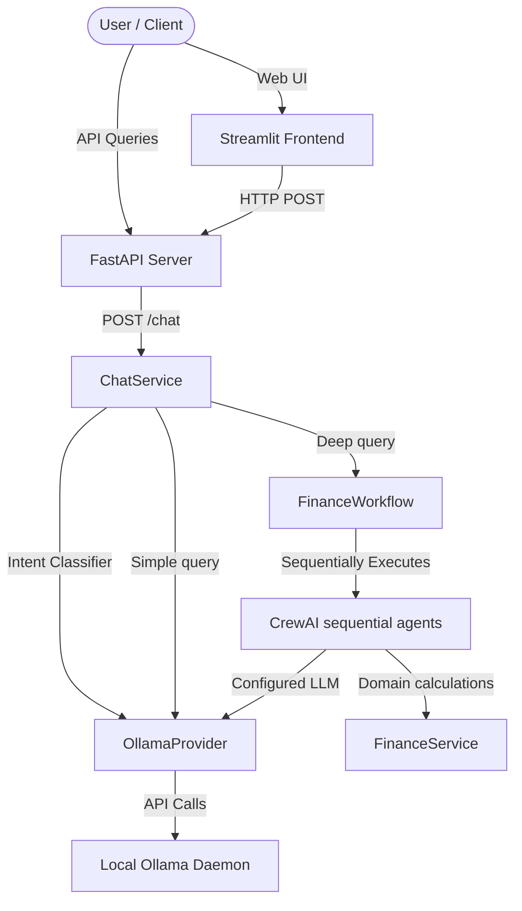
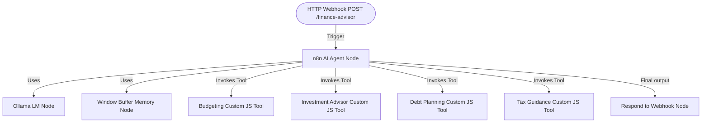

# Personal Finance Advisor (Dual Implementation)

A production-ready Personal Finance Advisor Chatbot implemented in two separate, independent architectures:
1. **Implementation A**: Python, FastAPI, CrewAI sequential agents, and Ollama (Local LLM).
2. **Implementation B**: Standalone n8n workflow utilizing the Advanced AI Agent node, Ollama LLM node, Window Buffer Memory node, and Custom Javascript Tools (all execution inside n8n).

---

## 🏗️ Architecture Diagrams

### Implementation A: Python & CrewAI Architecture


### Implementation B: Standalone n8n AI Agent Architecture


---

## 📂 Project Structure

```
project/
├── app.py                      # Streamlit frontend client (Implementation A)
├── api.py                      # FastAPI server entrypoint (Implementation A)
├── requirements.txt            # Dependency configs
│
├── config/
│   └── settings.py             # Settings using pydantic-settings
│
├── llm/
│   ├── base.py                 # Abstract LLMProvider interface
│   └── ollama_provider.py      # Ollama-specific status checker & wrapper
│
├── services/
│   ├── finance_service.py      # Core math logic (Implementation A)
│   └── chat_service.py         # Intent classification & routing (Implementation A)
│
├── workflows/
│   └── finance_workflow.py     # CrewAI sequential engine (Implementation A)
│
├── agents/                     # Budget, Debt, Investment, Tax CrewAI agents
│
├── tools/                      # Resilient tool helper for CrewAI agents
│
├── tests/                      # Python unit & E2E tests
│
└── docs/
    ├── n8n_chatbot.json             # n8n client proxy workflow (calls Implementation A)
    └── n8n_standalone_advisor.json  # Standalone n8n Chatbot Workflow (Implementation B)
```

---

## 🏃 Implementation A Setup (Python/CrewAI)

### 1. Setup local Ollama
Ensure local Ollama is running and has the model pulled:
```bash
ollama run llama3.2:3b
```

### 2. Configure Environment variables
Create a `.env` file in the project root:
```env
OLLAMA_BASE_URL=http://localhost:11434
OLLAMA_MODEL=llama3.2:3b
TEMPERATURE=0.7
MAX_TOKENS=1000
LOG_LEVEL=INFO
```

### 3. Run FastAPI Backend
Launch the API backend server:
```bash
uvicorn api:app --port 8000 --host 127.0.0.1
```

### 4. Run Streamlit UI Client
Launch the client application:
```bash
streamlit run app.py
```

---

## 🏃 Implementation B Setup (Standalone n8n)

Implementation B runs entirely inside n8n without hitting the Python backend.

### 1. Start Ollama
Ensure Ollama is running and accessible at `http://localhost:11434`.

### 2. Import Workflow into n8n
1. Open n8n, click **Workflows** -> **Add Workflow** -> **Import from File**.
2. Select [docs/n8n_standalone_advisor.json](file:///d:/Web_Development/finance_advisor-chatbot/docs/n8n_standalone_advisor.json).
3. The workflow will render an AI Agent connected to Ollama, Memory, and 4 Custom Tool nodes.

### 3. Custom Tools Inside n8n
The workflow contains 4 Custom Javascript Tools that execute mathematical formulas directly in n8n's environment:
- **`budget_tool`**: Divides monthly income using the 50-30-20 rule and computes emergency fund requirements (3-6 months coverage).
- **`investment_tool`**: Calculates expected compound maturity returns for SIP.
- **`debt_tool`**: Computes loan EMIs, interest totals, and payoff amounts.
- **`tax_tool`**: Outlines standard legal tax deduction instruments (Section 80C/80D).

### 4. Querying the Standalone Chatbot
Send a POST request to your n8n webhook URL:
```bash
curl -X POST http://<n8n-ip>:<port>/webhook/finance-advisor \
  -H "Content-Type: application/json" \
  -d '{"session_id": "test-session-1", "message": "I earn ₹50,000 per month, spend ₹35,000, and have a loan of ₹2,00,000 at 8% interest. How should I plan my budget and pay off my loan?"}'
```
The AI Agent node will dynamically execute the `budget_tool` and `debt_tool` within n8n, reason over the outcomes, and return a structured report with Summary, Recommendations, Risks, and Action Plan.